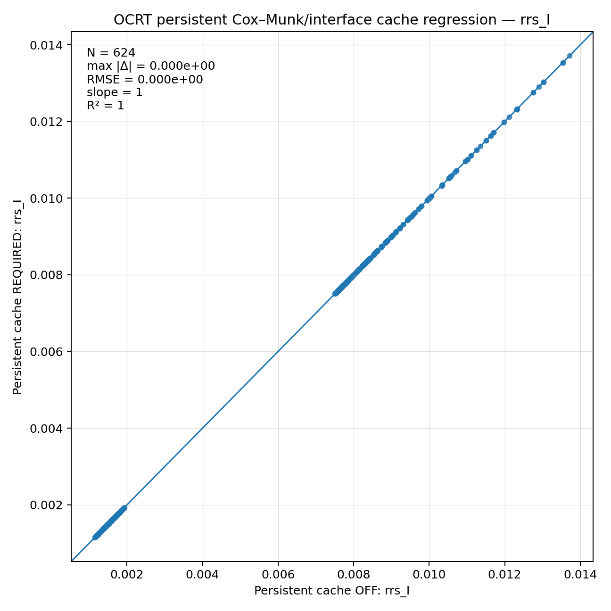
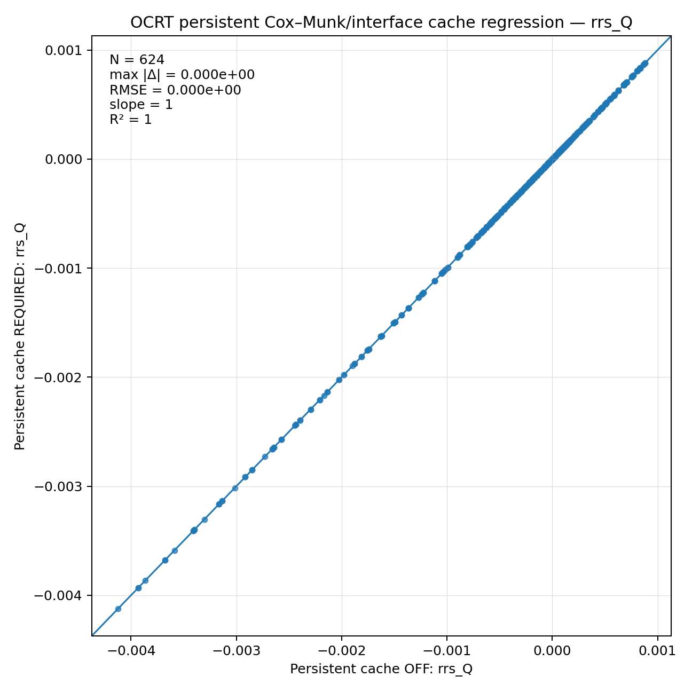
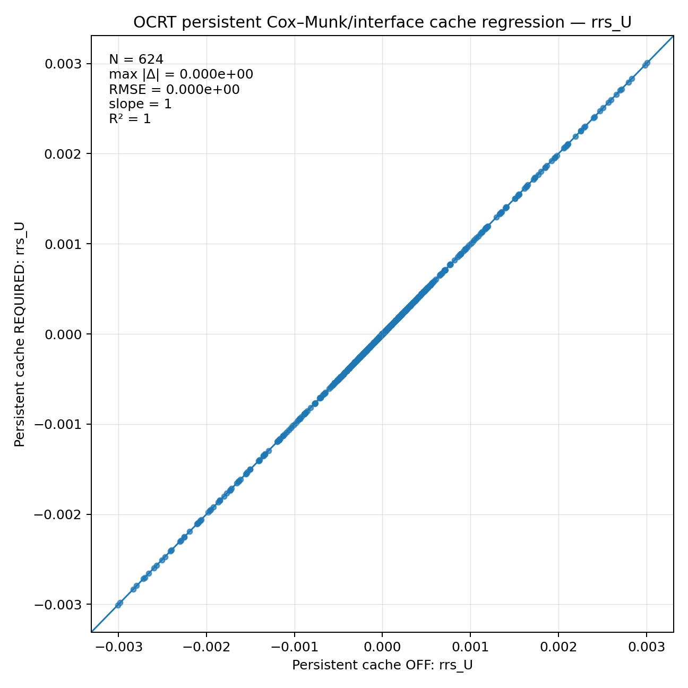
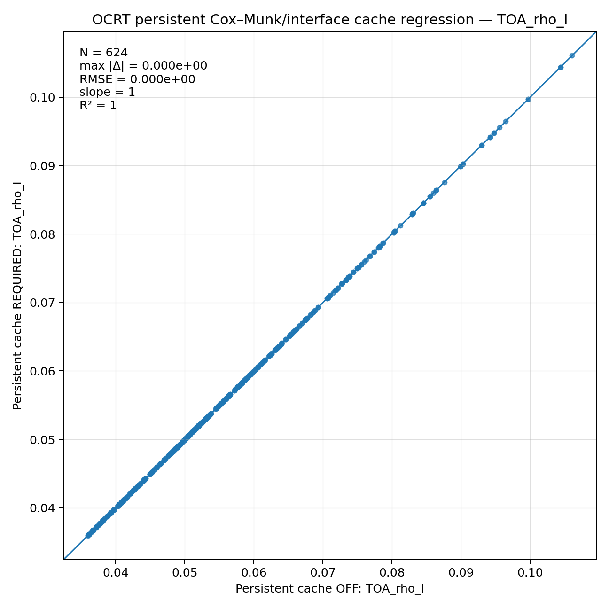
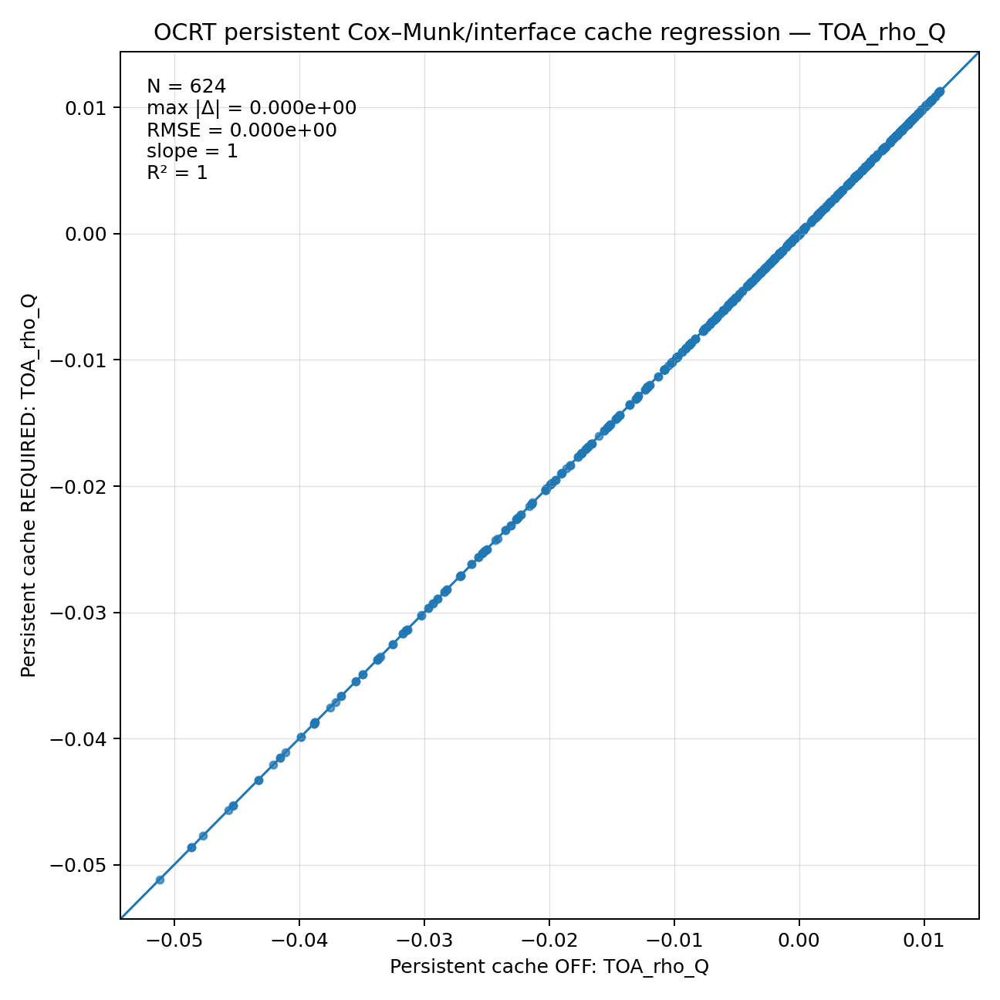
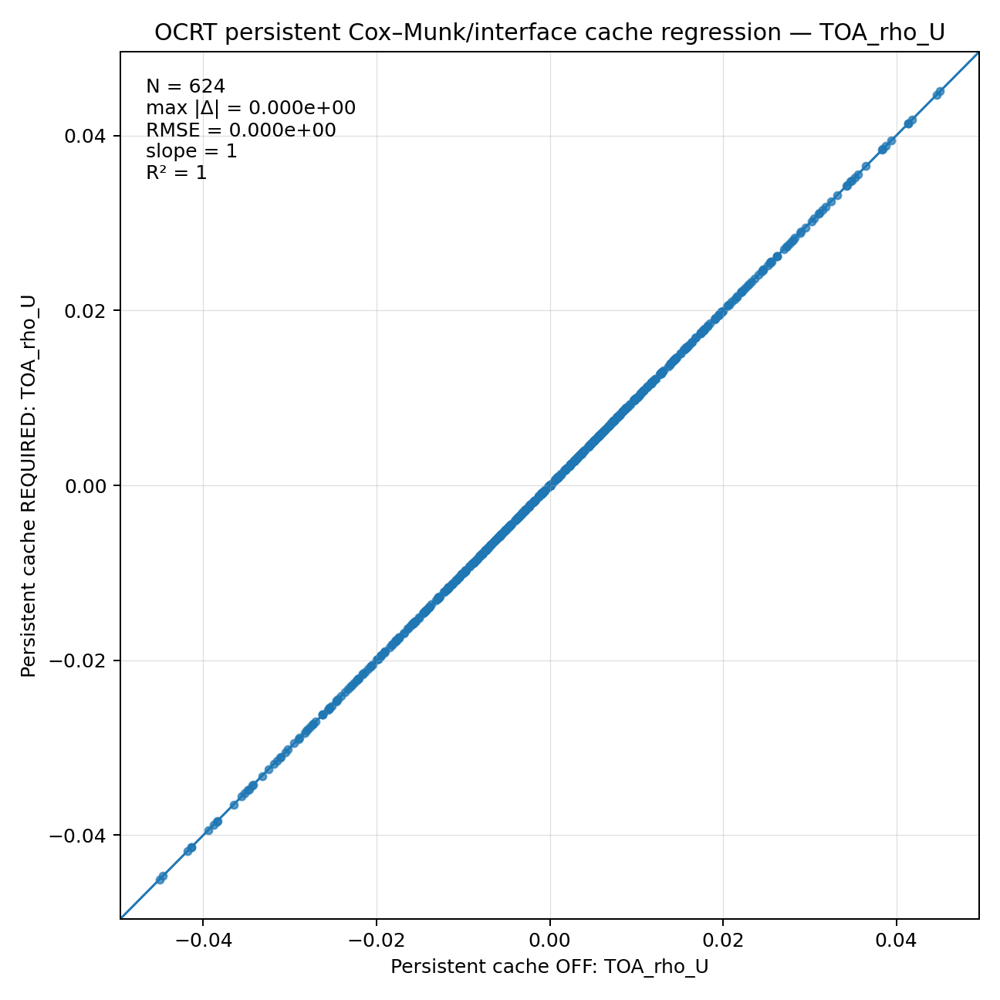

# Persistent cache OFF vs REQUIRED 산포도

- paired source: `persistent_cache_off_build_required_paired_source.csv`
- rows: 624

## Rrs_I

## Rrs_Q

## Rrs_U

## rrs_I

## rrs_Q

## rrs_U

## TOA_rho_I

## TOA_rho_Q

## TOA_rho_U

